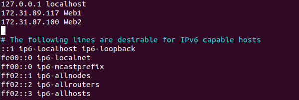
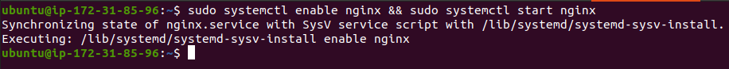
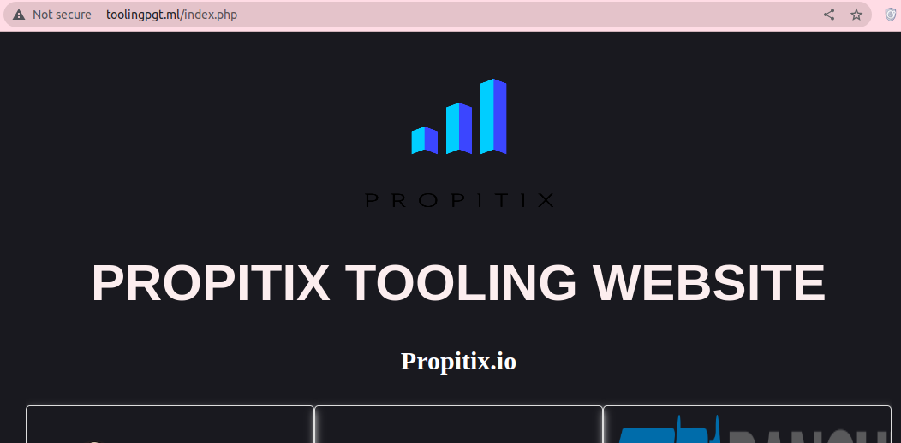

## Load Balancing Solution With NGINX And SSL/TLS

First Step-Configure NGINX As A Load Balancer

1. Launch an EC2 VM based on Ubuntu Server 20.04 LTS and name it Nginx-LB. Open TCP port 80 for HTTP connections, also open TCP port 443 for secured HTTPS connections.

 
 

2. Connect to the EC2 instance Update /etc/hosts file for local DNS with Web Servers’ names (e.g. Web1 and Web2) and their local IP addresses.
- Run `sudo vi /etc/hosts` then
add  Webserver1 and Webserver2 IP addresses and names.

 .

3. Install and configure Nginx as a load balancer to point traffic to the resolvable DNS names of the webservers.

  - Update  the server and install NGINX since it will be used as the reverse proxy.
    - Run `sudo apt update && sudo apt install nginx -y`

     .

- Enable and start nginx so that it persist whenever the server is restarted/rebooted. 
   - Run `sudo systemctl enable nginx && sudo systemctl start nginx`

    .

 - Check that nginx is runing as expected.
   - Run `sudo systemctl status nginx`

    .

 - Create configuration for reverse proxy settings. Congure Nginx LB using Webservers' names defined in /etc/hosts
sudo vi /etc/nginx/nginx.conf.

 

- Restart Nginx and make sure the service is up and running.
   - Run `sudo systemctl restart nginx`
   - Run `sudo systemctl status nginx`

     

Second Step - Register A New Domain Name And Configure Secured Connection Using SSL/TLS Certificates.

1. Register domain from any domain register. For this purpose, a domain toolingpgt.ml is registered at my.freenom.com.

    

2. Assigning an Elastic IP to your Nginx LB server and associate the domain name with the Elastic IP is the best approach but comes at a cost. For this presentation, the option of using the public IP of Nginx LB is utilized.

    - Connect ROUTE 53 AWS to Domain name and load balancer server.
    - Search for route 53 and create a pulic hosted zone under DNS management in AWS console.

    - Add domain name: toolingpgt.ml to the
public hosted zone then click create.

      

    - For route 53 hosted zone to be connected to toolingpgt.ml, copy the name servers of route 53 to custom name servers on freenom portal then click on change name servers. 

      

3. Create A record in the registrar (ROUTE 53) to point to Nginx LB public IP.

- create A record and add the LB public IP.
Add pulic IP of loadalancer to value segement leave the rest of the entry in default and hit create record.

  

- Create A record type for record name: .toolingpgt.ml and second A type record for record name: www.toolingpgt.ml then add pulic IP of loadalancer to value segement to both as well then click create record.

  

- Check that the webservers can be reached from the browser using new domain name with HTTP protocol.
  -  enter domain in browers- http://toolingpgt.ml/login.php

  

4. Secure the website with Letsencript by installing the certbot software and its dependencies. From the loadbalancer terminal:
   - Run `cd` to come out of all the directory.
   - Run `sudo apt install certbot -y`.
   - Run `sudo apt install python3-certbot-nginx -y`.

      
    

- Check that there is no error in the syntax and reload nginx.
   - Run `sudo nginx -t && sudo nginx -s reload`.

      

5. Install certbot and request for a SSL/TLS certificate. Create a certificate to secure the domain - toolingpgt.ml and provide a valid email address for renewal and notices when requested. view service aggrement, and yes or no to share email details with the foundation after which the new certificate will be created. Then choose 2 to redirect request to secure https access. (http -port 80, https - port 443).
- Run `sudo certbot --nginx -d toolingpgt.ml -d www.toolingpgt.ml` 
email: izikayanda@gmail.com, A to agree with terms, 
(snapshot)

- Check that the url toolingpgt.ml is now securred with https by refreshing the page.

  

- Create a crontab assignment to automatically renew the certificate when it expires.
    - Run `crontab -e` then 
    - past `*/12 * * * root /usr/bin/certbot renew > /dev/null 2>&1`
    - under m h dom mon dow command then save.

    

